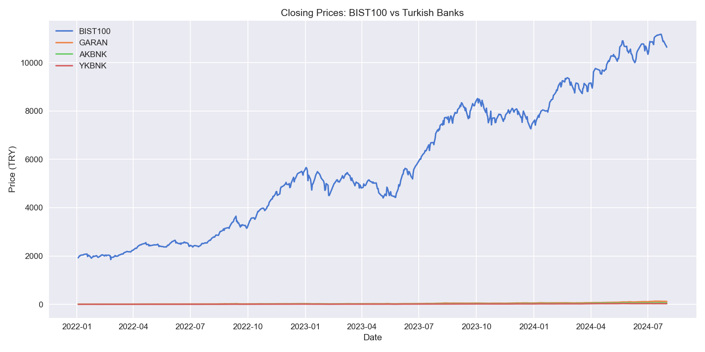
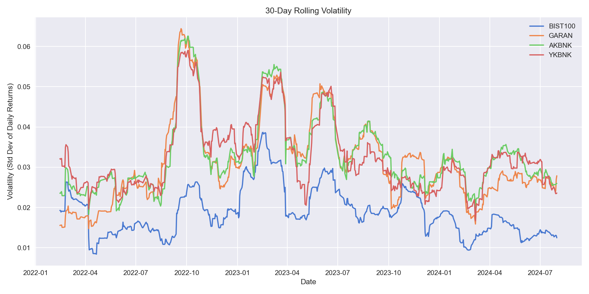
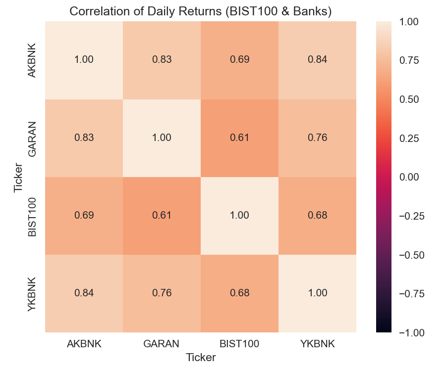

# BIST Market Snapshot — XU100 & Turkish Banks (2022–2024)

A compact, reproducible analysis of the **BIST 100 Index (XU100)** and three major Turkish banks: **GARAN.IS**, **AKBNK.IS**, **YKBNK.IS**.  
The notebook fetches prices with `yfinance`, computes daily returns, moving averages, rolling volatility, and compares correlations.  

<p align="center">
  
  
</p>

<p align="center">
  
</p>

---

## Why this repo?
- Real market data • clear visuals • concise insights  
- One-file reproducibility (Jupyter Notebook)  
- Relevant to finance/data roles (time series, KPIs, presentation)

---

## Tech Stack
- Python 3.11+
- pandas, numpy
- matplotlib, seaborn
- yfinance

---

## Quickstart

```bash
# clone & enter
git clone https://github.com/<your-username>/bist-market-snapshot.git
cd bist-market-snapshot

# (optional) create & activate virtual env
python -m venv .venv
.venv\Scripts\activate     # Windows
source .venv/bin/activate  # macOS/Linux

# install deps
pip install -r requirements.txt
